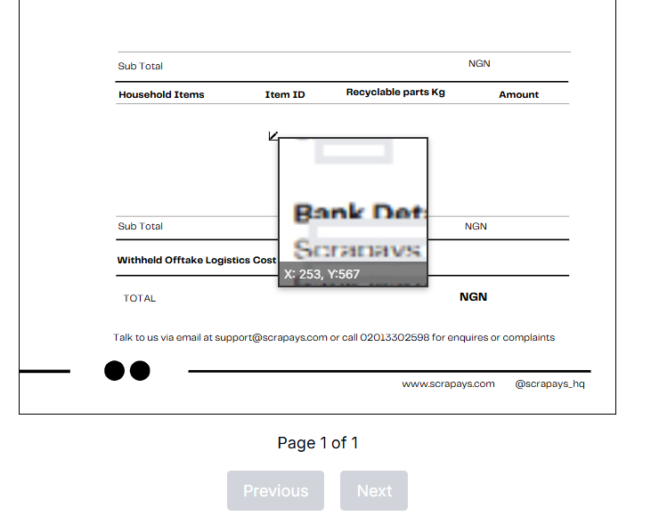

# PDF Coordinate Extractor with Pixel Zoom

A simple landing page application that lets you select (or drag and drop) a PDF file, preview it, and capture the pixel coordinates of any element where the mouse hovers. The interface also provides a pixel zoom effect so you can precisely see and copy the coordinates.

## Overview

This project is designed to help you extract precise coordinates from a PDF preview. The key features include:

- **File Selection:** Choose a PDF file via a file selector or drag-and-drop.
- **PDF Preview:** Render a preview of the selected PDF.
- **Coordinate Capture:** As you hover your mouse over the PDF preview, the application displays the coordinates (in pixels) of the hovered element.
- **Pixel Zoom Effect:** The hovered area is magnified, allowing you to see fine details and ensuring accurate coordinate capture.
- **Copy to Clipboard:** Click on the preview to copy the coordinate values for easy use.

This project is built with React and leverages modern web APIs to deliver a smooth user experience.

## Features

- **Drag and Drop / File Select:** Easily load your PDF file.
- **PDF Preview:** View the selected PDF directly on the landing page.
- **Mouse Coordinate Display:** Dynamic coordinate readout based on where your mouse is located.
- **Pixel Zoom:** Magnified view of the hover area for precise coordinate capture.
- **Copy Functionality:** Click to copy the coordinate values for further use.

## Demo



## Installation

To run the project locally, follow these steps:

1. **Clone the repository:**

   ```bash
   git clone https://github.com/your-username/pdf-coordinate-extractor.git
   cd pdf-coordinate-extractor
   ```

2. **Install dependencies:**

   ```bash
   npm install
   # or
   yarn install
   ```

3. **Start the development server:**

   ```bash
   npm start
   # or
   yarn start
   ```

4. Open your browser and navigate to [http://localhost:3000](http://localhost:3000).

## Usage

1. On the landing page, either drag and drop a PDF file into the designated area or use the file select button.
2. Once the PDF is loaded, hover over the preview area to see the pixel coordinates of the element under your cursor. A magnified view (pixel zoom effect) will help you verify the details.
3. Click on the preview to copy the coordinates to your clipboard.
4. The copied coordinates are displayed in a small overlay box for your reference.

## Contributing

Contributions are welcome! If you have suggestions, bug reports, or improvements:

- Fork the repository.
- Create a new branch for your feature or fix.
- Commit your changes and open a pull request.

Please follow the existing code style and add tests where applicable.

## License

This project is open source and available under the [MIT License](LICENSE).

## Acknowledgements

This project was inspired by various coordinate extraction and image zoom techniques available online. Special thanks to the developers who have shared their knowledge on how to capture mouse coordinates and apply CSS transforms for pixel zoom effects.

---

Feel free to customize this README as needed for your project.
